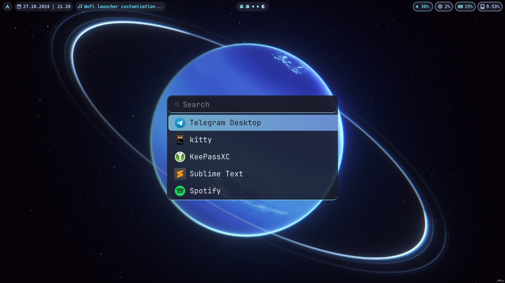
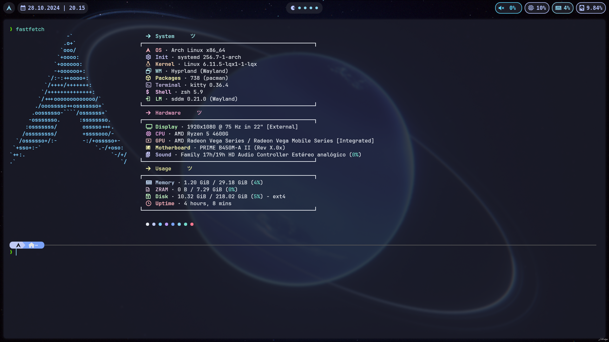
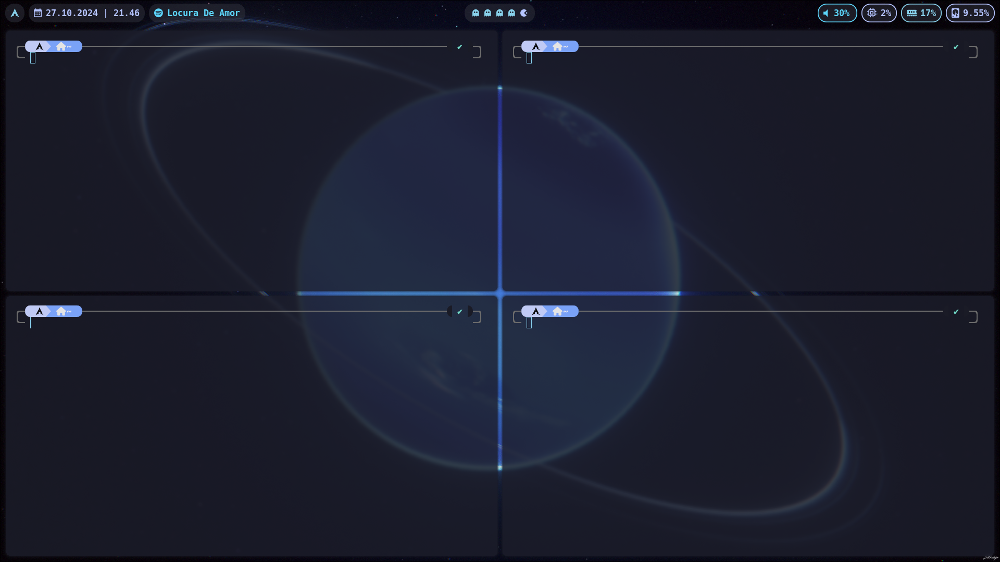
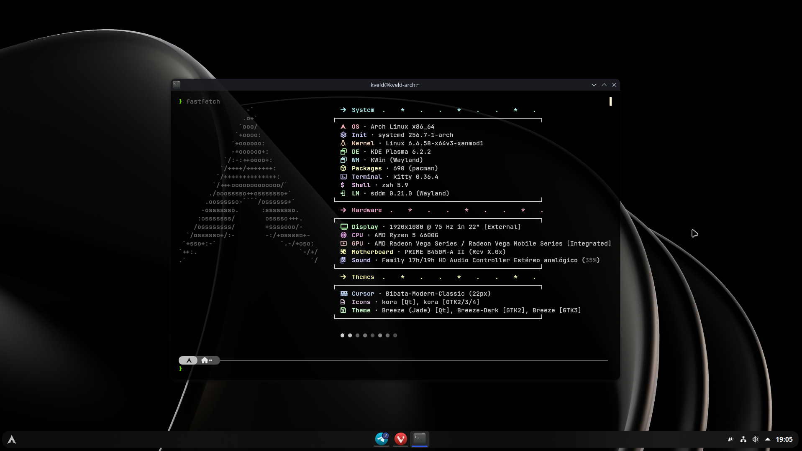
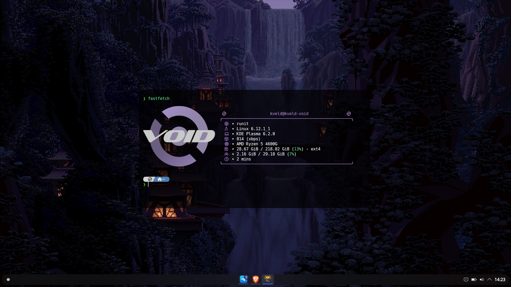

# dotfiles

## Hyprland on Arch Linux.
- [Wofi](https://man.archlinux.org/man/wofi.1.en)
- [HyprPanel](https://hyprpanel.com/)
- [KittyTerminal](https://github.com/kovidgoyal/kitty)
- [Wallpaper](https://wallhaven.cc/w/zyj8gw)

## KDE Plasma on Arch Linux.
- [KDE Rounded Corners](https://github.com/matinlotfali/KDE-Rounded-Corners)
- [KittyTerminal](https://github.com/kovidgoyal/kitty)
- [Wallpaper](https://unsplash.com)

## KDE Plasma on Void Linux.
- [KDE Rounded Corners](https://github.com/matinlotfali/KDE-Rounded-Corners)
- [KittyTerminal](https://github.com/kovidgoyal/kitty)
- [Wallpaper](https://wallpapercave.com/w/wp1933958)
- [fastfetch-config](fastfetch/config-void.jsonc)

